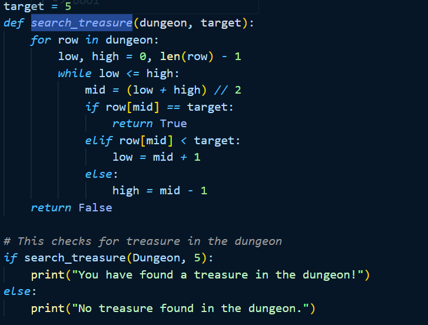
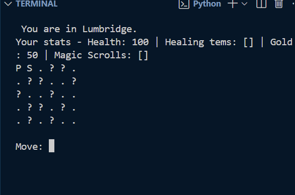
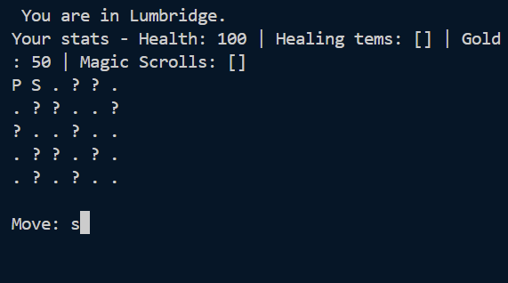
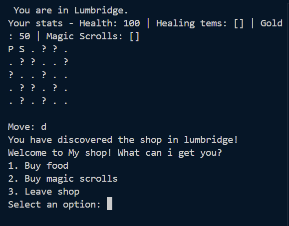
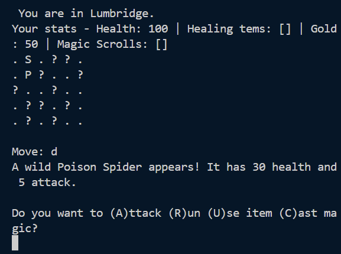
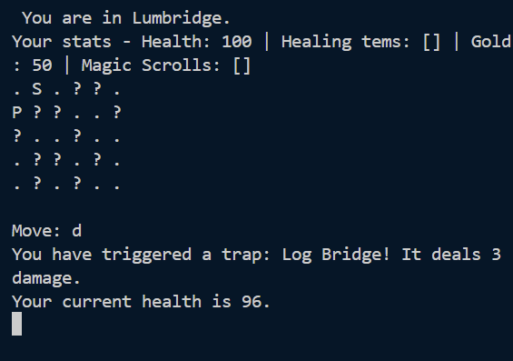
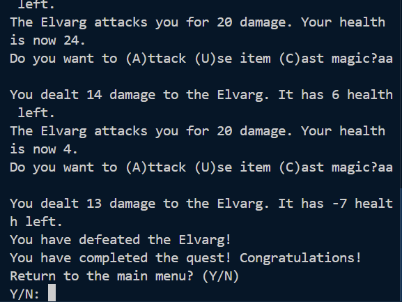
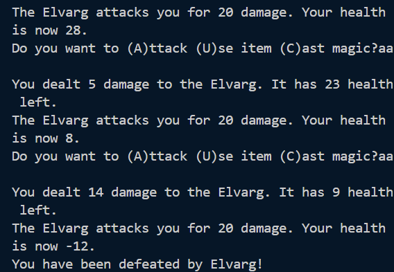

# Introduction

Gilienor game is my collaboration of methods learnt within our first semester. This is a treasure hunting game which allows two players to traverse the world battling monsters, avoiding traps, finding treasure and ultimately defeating the boss in the dungeon at the end of the game. The players use familiar controls 'wasd' in order to travel across the game board with markers showing that something (or someone) may be in the path ready to attack. 

# Project Overview

## Inspiration
I decided for my game to give it a theme in which i was comfortable with and could add in my creative side. I took a lot of my inspiration from a popular mmorpg 'Runescape' in order to clearly set my goals of what i wanted the players to achieve. The town, enemies and the boss are taken as inspiration however the direction is randomly generated so that the user experiences different monsters and traps each time they play.

## Direction of the game
From the introduction, the player is given a brief overview of what is transpiring in the land. This is to give player purpose and direction so they understand what they need to achieve in order to beat the game. This is paired with warnings of the dangers and players will need to prepare themselves before setting off on their journey. I wanted to add in a shop to not only give the world life, but to also give players the option to take a break from the dangers outside of the town walls.

## player interaction
With this being a somewhat rpg game, i wanted the player to have full freedom of the items/spells that they can use in combat. I added in the shop mechanic so that the player can stock up on supplies to give them that edge. For example i added in a dodge ability that would lower the damage take from enemies, this is especially helpful if they come up against something with higher health/damage giving a level of difficulty to the game. As the players traverse the world, if they do come across an enemy that they cannot fight due to low health, they can avoid the encounter with the 'Run' option. This adds a level of safety and control to the player, however, this is not available for the boss.

## Movement and combat
During combat, the game goes into a turn based mode where the players and monsters will take turns to either attack or use an item/spell. For this prototype i have made it so the player always goes first just for ease with understanding how the program runs but also giving a chance to run from the encounter just in case.

# Challenges and Solutions

## Binary Search
With my binary search, i have had issues implamenting it into my game. I have tried various ways to incorporate it however I wasnt able to get it to find an outcome where the outcome is either a selection (Inventory) or map interaction. This was due to the format of the map grid itself and how all of the other entities react with it. In this case i have reverted to a simplified randomiser for the map and list functions for the inventory.

## Timeframe
My lack of understanding for algorithms caused a very large setback in my project. A lot of my time has been spent in trial and error with not much of a breakthrough. I have therefore stuck with what i understand and attempted to make the game enjoyable whilst also demonstrating the skills i understand whilst also pushing myself.

## Variety
For my encounters i wanted this to be the random side of my game to simulate wandering around a wilderness where ambushes were the big threat. For this i created my list of monsters that varied in difficulty based on their health and damage. This was easy enough to implament and really gave some depth to the encounters.

## 2 player
I wasnt entirely sure how to create a 2 player session. I had implamented multiple stages during the game where it would check if a second player was present, however, it wouldnt run properly and would further skip any interaction with the player.

# Search Algorithms

### Binary search

I have attempted to utilize Binary Search within my code however it currently doesnt work. I was looking to use the binary search within my dungeon grid in order to find the treasure within.

# Pseudocode/flowchart

## Flowchart
Here is the flowchart for my game.

## Pseudocode
The game is controlled by using W,A,S,D to move around the map, W for up, A for left, S for down and D for right. If the players health reaches zero then the game returns the player back to the start. The winning condition is if the bosses health reaches zero and the player is similarly returned to the start with +1 to their completion statistics.  

# Test Evidence

## Movement

This shows my map displaying correctly with the shop visible and the traps and monsters hidden for randomisation.

This shows the player inputting 'd' to move down within the grid.

This shows the player arriving at the shop with the initial selection window.

This shows the further menu for the shop where the player may select an item to buy

## Combat

This shows a combat sequence that has been randomised selecting a monster from the 'monsters' table.

This shows a trap sequence triggered by the player where the players health has been updated

## End Goal

This shows the end of the game where the player has successfully defeated the boss.

This shows the player failing to defeat the end boss causing a game over.

# Conclusions

This project has been very difficult to grasp for me, however i feel the techniques that i have implamented have been executed well to give the experience intended. I am happy that the game can play from start to finish with minor errors, if any. However, i am still confused with algorithms and how to implement them in a project like this successfully. In the future i need to spend more time understanding binary search 